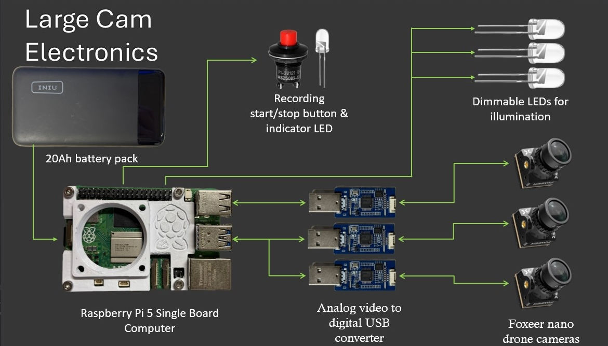
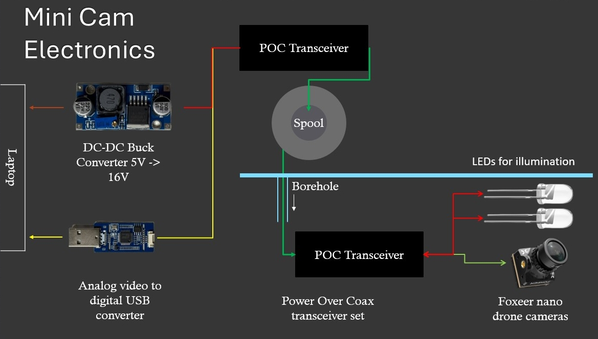

# GISP-Cam
A simple, low-cost camera system for deep borehole inspections.
- [ ] todo: finish README.md
- [ ] todo: add images from tests
___
## Table of Contents
- [Introduction](#introduction)
  - [Motivation](#motivation)
  - [Features](#features)
- [Hardware](#hardware)
  - [GISP-Cam](#gisp-cam)
  - [GISP-Cam Mini](#gisp-cam-mini)
- [Software](#software)
- [Installation](#installation)
- [Usage](#usage)
- [Testing](#testing)
  - [Testing the GISP-Cam](#testing-the-gisp-cam)
  - [Testing the GISP-Cam Mini](#testing-the-gisp-cam-mini)
- [Future Work](#future-work)

## Introduction
The GISP-Cam system is built with commercially available electronic components, avoiding proprietary software and hardware
requirements. 
This project has been made possible by the University of Kansas' Department of Physics and Astronomy Machine Shop. Thanks to Mark Stockham and Scott Voigt for all their suggestions, patience, and time designing and machining the enclosures to fit the cameras and electronics as well as with testing.

### Motivation
The Greenland Ice Sheet Project 2 (GISP2) was a multinational ice core drilling project in Greenland located at the summit
of the Greenland ice sheet. The project was conducted in the early 1990s and retrieved over 3000 meters of ice core.
The site of the GISP2 camp is now the location of the National Science Foundation's Summit Station. Summit Station is
now a year-round research station which hosts two different two different neutrino detector experiments which are 
deployed in the ice sheet, the Radio Neutrino Observatory (RNO-G) and the Radar Echo Telescope (RET). The GISP2 borehole
site is still accessible though the upper casing has degraded such that access to equipment and large cameras is no longer
possible beyond about 60 feet down due to casing deformation. The state of the casing beyond this and the lower borehole
section is largely unknown.
 
The GISP-Cam system is being developed to investigate the state of the borehole casing above and below the 60 foot 
deformation.

### Features
- Low cost
- Easy to build, maintain, and operate
- wide field of view

## Hardware

### GISP-Cam Large

- 1x Raspberry Pi 5
- 4x Foxeer Nano Toothless 2 FPV Cameras
- 4x CVBS to USB Video Capture Cards
- 1x 20,000 mAh Power Bank
- 1x machined housing (in development as of Feb 1 2025)
- 1x Single Channel Power Over Coax Transceiver
- 3x LEDs
- 1x Momentary switch
- various wiring and connectors
#### Electronics

The above image shows the electronics laid out prior to assembly in the final enclosure. The pictured wiring and camera/LED frame were used for testing and are not representative of the final product.

#### Camera Enclosure

#### Nose Cone

#### Nose Cone Internal Component View 
 Exterior |   Forward camera and LEDs
:-------------------------:|:-------------------------:
 Radial LEDs (shrouded) |   Radial camera frame and angled LEDs

### GISP-Cam Mini

- 1x Foxeer Nano Toothless 2 FPV Camera
- 1x CVBS to USB Video Capture Card
- 1x Single Channel Power Over Coax Transceiver
- 2x LEDs
- various wiring and connectors
#### Camera Enclosure

#### 

## Software

## Testing

